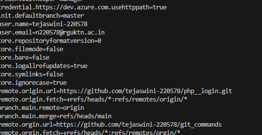

## 1. git config --global user.name

Syntax:
git config --global user.name "tejaswini-220578"

Purpose:
Sets your Git username globally.

Example:
git config --global user.name "Siva"

## 2. git config --global user.email

Syntax:
git config --global user.email "n220578@rguktn.ac.in"

Purpose:
Sets your Git useremail globally.

Example:
git config --global user.email "tejaswini@gmail.com"

https://github.com/tejaswini-220578/git_commands

## 1. git config --list

Syntax:
git config --list

Purpose:
Display all git configurations settings (username,email,editor etc..)
Example:
user.name=tejaswini
user.email=tejaswini@gmail.com
core.editor=code

screenshot proof:
